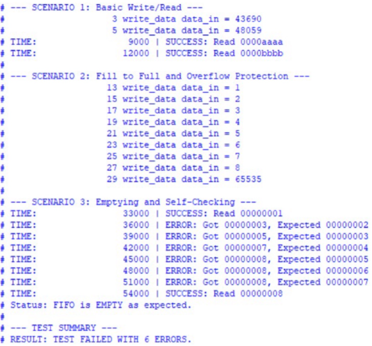
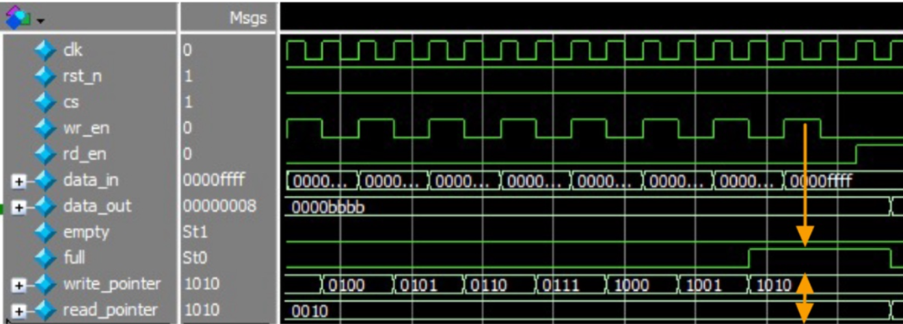
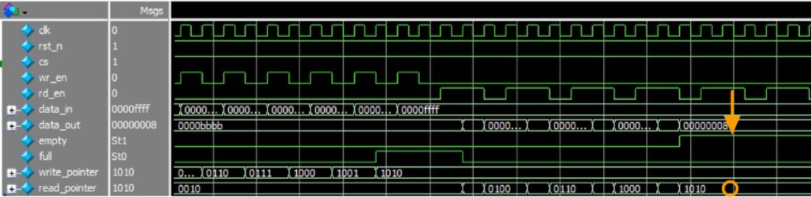

# Synchronous FIFO with Protection Logic

A parameterized synchronous FIFO implementation in Verilog, designed for high reliability and data integrity in digital systems.

## Key Features
* **Parameterized Architecture**: Easily adjustable `DATA_WIDTH` and `FIFO_DEPTH` to fit various system requirements.
* **Overflow & Underflow Protection**: Integrated hardware logic that prevents data corruption by masking write attempts when full and read attempts when empty.
* **Self-Checking Testbench**: A comprehensive verification suite that automatically validates data consistency and corner-case behavior.

## Simulation & Verification
The design was verified using ModelSim/Questa. All test scenarios, including extreme corner cases, passed successfully:

## Logic Analysis (Waveform Results)

### Overflow Protection
When the FIFO reaches its maximum capacity, the `full` flag is asserted. As shown in the waveform, any subsequent `wr_en` signals are ignored, and the `write_pointer` remains stable, ensuring that existing data is not overwritten.

### Underflow Protection
The `empty` flag prevents the `read_pointer` from incrementing when no data is available. This ensures that the system does not output "garbage" data during empty states.

